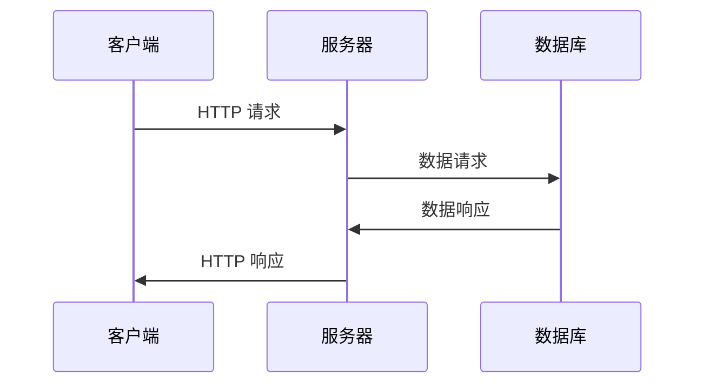

是一个用于创建 [[什么是 RESTful|RESTful]] web 应用的开源 Java 框架

和其他 web 框架一样, 提供了一套完整代码规范和脚手架, 这样就不需要为每个项目重新设计和编写, 让开发者专注于应用的核心逻辑 (类似只适用于 Java 的 Node.js)

包含很多不同种类应用的模版, Spring Boot 是创建 Spring web 项目的方式中最简单的一种, 使应用以最简化的配置来运行

Spring web 应用的工作原理是如下面这张图所示, 展示了典型的 HTTP GET 请求流程:

1. 客户端发送一个 GET 请求到 Sprint web 服务器上, 即 Spring 应用
2. 服务器发送一个数据请求到数据库来获取客户端想要的数据
3. 如果有对应数据, 数据库发回请求的数据到服务器上
4. 服务器发回数据 (即 HTTP 响应) 到客户端并展示在浏览器上

以上只是其中一种应用场景, 客户端并不只是浏览器, 还可能是桌面应用或者移动应用, 也不一定要和数据库交互